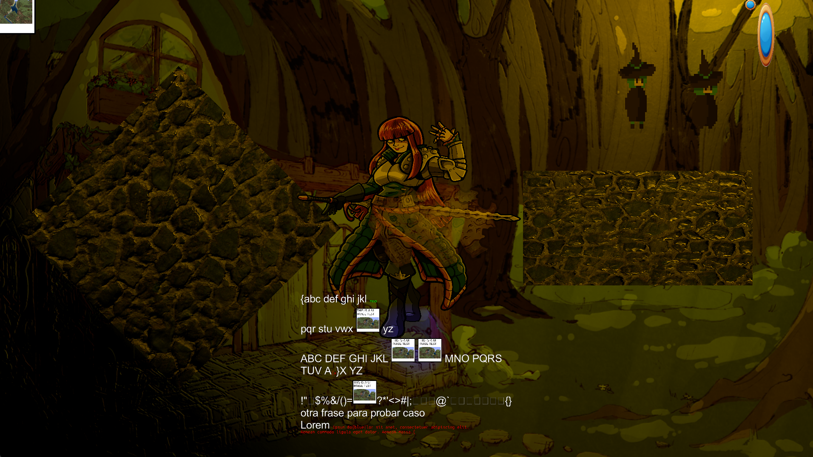

# VULKAN GAME ENGINE

## Description
A game engine programmed in C++ using Vulkan as a didactic exercise to learn game engine development at its lowest level.

## Features
+ Multithreading
+ Jobs system
+ Vulkan renderer
+ Material system
+ Shader system
+ Texture system
+ ECS
+ UI system
+ Font system
+ Text rendering
+ Audio system
+ Resource manager
+ Png, jpg, .bmp, .tga support
+ Event system
+ Logger system
+ Input system
+ Platform specific arquitecture
+ Render-view system
+ Camera system
+ Memory system
+ Ring queue

## Installation
You must install LunarG Vulkan SDK, and after that:
+ Execute the script "BuildProject.bat"
+ Go to "build" folder and open the `.sln`
+ Finally press `F5`.

## Acknowledgements
+ "Game Engine Architecture" by Jason Gregory
+ https://github.com/nothings/stb
